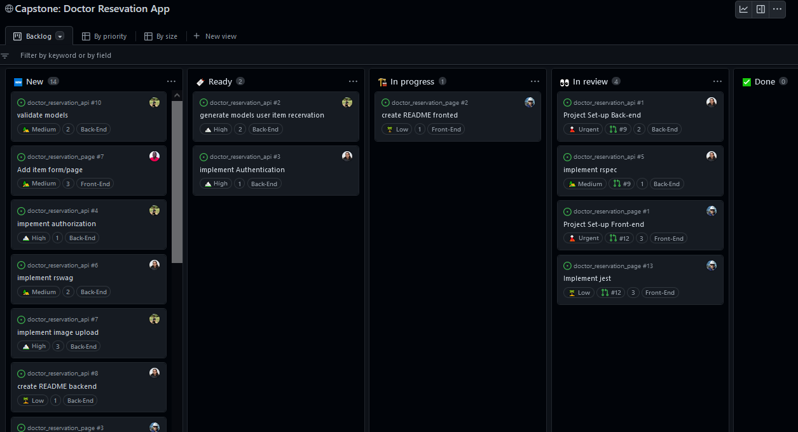

<a name="readme-top"></a>

<div align="center">
  <h3><b>Doctor Reservation Capstone Project (FrontEnd)</b></h3>
  <h4>
   <a href="https://github.com/carlosmuerto/doctor_reservation_api">
    Doctor Reservation Capstone Project (BackEnd)
   </a>
  </h4>
  
</div>

# 📗 Table of Contents

- [📖 About the Project](#about-project)
  - [🛠 Built With](#built-with)
    - [Tech Stack](#tech-stack)
  - [📊 Kanban board](#live-demo)
  - [🚀 Live Demo](#live-demo)
- [💻 Getting Started](#getting-started)
  - [Setup](#setup)
  - [Prerequisites](#prerequisites)
  - [Install](#install)
  - [Usage](#usage)
  - [Deployment](#deployment)
- [👥 Authors](#authors)
- [🔭 Future Features](#future-features)
- [🤝 Contributing](#contributing)
- [⭐️ Show your support](#support)
- [🙏 Acknowledgements](#acknowledgements)
- [📝 License](#license)

<!-- PROJECT DESCRIPTION -->

# 📖 Doctor Reservation Capstone Project (FrontEnd) <a name="about-project"></a>

> Describe your project in 1 or 2 sentences.
**Doctor Reservation Capstone Project (FrontEnd)** is a Implement a connection between a Ruby on Rails back-end and React front-end.

## 🛠 Built With <a name="built-with"></a>

### Tech Stack <a name="tech-stack"></a>

<details>
  <summary>Client</summary>
  <ul>
    <li><a href="https://react-redux.js.org/">React Redux</a></li>
  </ul>
</details>

<details>
  <summary>Server</summary>
  <ul>
    <li><a href="https://expressjs.com/">React</a></li>
  </ul>
</details>

<details>
<summary>Database</summary>
  <ul>
    <li><a href="https://www.postgresql.org/">API/PostgreSQL</a></li>
  </ul>
</details>

<!-- KANBAN BOARD -->

# 📊 Kanban board <a name="kanban-board"></a>

<details>
  <summary>Kanban board link</summary>
  <ul>
    <li><a href="https://github.com/users/carlosmuerto/projects/9/views/1">Project</a></li>
  </ul>
</details>

<details>
  <summary>Initial Kanban board</summary>
  <div>
  
  
  </div>
</details>

<details>
  <summary>Team members</summary>
    
  <ul>
    <li><p>Total: 3 members<p></li>
  </ul>

  <summary>Names:</summary>
  <ol>
    <li>Erik Stoupignan Sánchez Beltrán</li>
    <li>Carlos Vivas</li>
    <li>Matias Aguirre</li>
  </ol>
</details>
<!-- LIVE DEMO -->

# 🚀 Live Demo <a name="live-demo"></a>

- [Front-End project](https://stately-sunflower-3e9b13.netlify.app/)
- [Back-End API](https://doctor-reservation-api-k121.onrender.com)


<p align="right">(<a href="#readme-top">back to top</a>)</p>

<!-- GETTING STARTED -->

## 💻 Getting Started <a name="getting-started"></a>

<!-- > Describe how a new developer could make use of your project. -->

To get a local copy up and running, follow these steps.

### Prerequisites

In order to run this project you need: 
 
 ```sh
 cmd: 'npm start'

 (If you want to use the program locally between Front End and Back End, you have to change the URL in: './src/redux/URL_API.js'. There you will find a variable called < BASEURL >, just change it.)
```

### Setup

Clone this repository to your desired folder:

```sh
  git clone 'https://github.com/carlosmuerto/doctor_reservation_page.git'
  cd setup-ror-project
```


### Install

Install this project with:

```sh
  npm install
```

### Usage

To run the project, execute the following command:


```sh
  npm start
```

### Deployment

You can deploy this project using:

```sh
  Netlify
```


<p align="right">(<a href="#readme-top">back to top</a>)</p>

<!-- AUTHORS -->

## 👥 Authors 
<a name="authors"></a>

👤 **Erik Stoupignan Sánchez Beltrán**

- GitHub: [@ErikStoupignan](https://github.com/ErikStoupignan)
- Twitter: [@Erik_Stoupignan](https://twitter.com/Erik_Stoupignan)
- LinkedIn: [Erik Stoupignan Sánchez Beltrán](https://www.linkedin.com/in/erik-sanchez-beltran/)

👤 **Matias Aguirre**

- GitHub: [@LokurasRlz](https://github.com/LokurasRlz)
- LinkedIn: [LinkedIn](https://www.linkedin.com/in/matiaguirre/)

👤 **Carlos Vivas**

- GitHub: [@carlosmuerto](https://github.com/carlosmuerto)
- LinkedIn: [LinkedIn](https://www.linkedin.com/in/carlos-vivas-818ab831/)

<p align="right">(<a href="#readme-top">back to top</a>)</p>

<!-- CONTRIBUTING -->

## 🤝 Contributing <a name="contributing"></a>

Contributions, issues, and feature requests are welcome!

Feel free to check the [issues page](../../issues/).

<p align="right">(<a href="#readme-top">back to top</a>)</p>

<!-- SUPPORT -->

## ⭐️ Show your support <a name="support"></a>

> Write a message to encourage readers to support your project

If you like this project...

<p align="right">(<a href="#readme-top">back to top</a>)</p>

<!-- ACKNOWLEDGEMENTS -->

## 🙏 Acknowledgments <a name="acknowledgements"></a>

This project was inspired by the design created by [Murat Korkmaz](https://www.behance.net/muratk) that you can find on [Behance](https://www.behance.net/gallery/26425031/Vespa-Responsive-Redesign).


<p align="right">(<a href="#readme-top">back to top</a>)</p>

## 📝 License <a name="license"></a>

This project is [MIT](./LICENSE) licensed.

<p align="right">(<a href="#readme-top">back to top</a>)</p>
